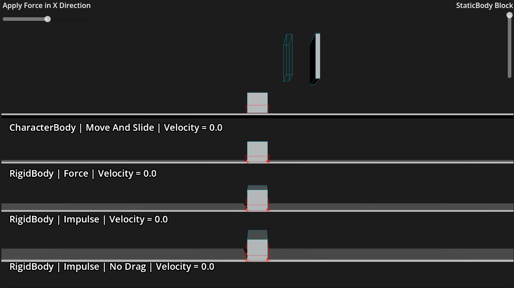
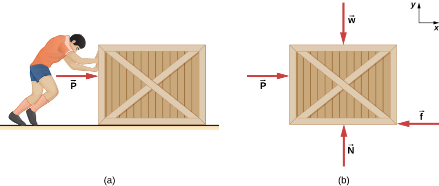
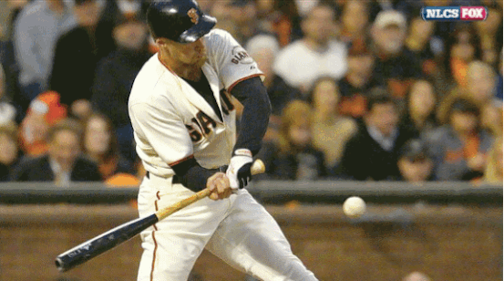

# Movement Lesson
## Option 1 - Running the Project
You can run the project directly through the [web](https://mjrevel.github.io/laughingrelic.github.io/movement-lesson/movement-lesson.html)
<br/>
[](https://mjrevel.github.io/laughingrelic.github.io/movement-lesson/movement-lesson.html)
<br/>
Movement: Use the arrow keys to move the objects left and right
## Option 2 - Installing and Running the Project
### Requirements
- Godot 4.6+ installed, alternatively you use the [Godot Web Editor](https://editor.godotengine.org/releases/latest/)
- Basic Godot user interface knowledge

Download the [source code](https://github.com/mjrevel/movement-lesson)
## Questions to Consider
- What do you think you can make with the different body types?
- Modify the external force direction. Which bodies does it affect? Why?
- Which bodies are changing direction instantaneously? Why?
## Types of Movable Bodies
What is a body? A body is a game object that has physical properties, depending on the specific body it can be affected by gravity, drag, and collision. Typically game engines refer to these body types as **static**, **kinematic**, and **dynamic**. Godot refers to these bodies as **static**, **character**, and **rigid** (following the same order). 

**static** - Bodies that don't move. Think of these as non-movable objects, like walls or terrain
<br/>
**kinematic** - Bodies that can move, but don't respond to forces. Think of these as moving platforms, or user controlled bodies that need to move in a predictable manner
<br/>
**dynamic** - Bodies that can move, but only through forces. Think of these as anything in your game world that needs to move in a realistic way. Usually requires a bit more work to get the physics just right.

Keep these in mind for now, we'll talk about them again soon in another section.
## Physics Introduction
**Note:** I promise I won't turn this into a full on physics course (believe me when I say, I'm not even properly qualified in doing so), but I love how models can help us understand more complex systems.


Most, if not all game engines handle forces in a similar to the force diagram shown below. As you'll see down in further examples that we move the player by generating a force to overcome other external forces such as gravity and friction.
<br/>

**Velocity**  - Measurement of speed in a certain direction
<br/>
**Acceleration** - A change in velocity
<br/>
**Momentum** - Product of mass and velocity
<br/>
**Force**(N) - An action that causes an object to change its velocity by resisting other forces
<br/>
<span style="text-decoration: overline;">v</span> = Δs/Δt (Velocity in Godot is pixels per second)
<br/>
F = *m***a**

**Impulse**(Ns) - A force applied over time that changes the momentum of an object. 
<br/>
p(Momentum) = *m***v**
<br/>
J(Impulse) = FΔ*t*
## PhysicsBody Types
*As you learn Godot. You'll find that there are some exceptions to the rules. Use this table as a guideline for how different physics bodies should be used (not how they can be used).* 

| Physics Body                                                                                          | Moved Manually | Moved by Forces | Affects Bodies While Moving | Receives Collision Callbacks | Gravity Scale / Custom Physics |
| ----------------------------------------------------------------------------------------------------- | :------------: | :-------------: | :-------------------------: | :--------------------------: | :----------------------------: |
| **StaticBody** (2D & 3D)<br><small>Immovable collider. Does not move at all.</small>                  |       ☐        |        ☐        |              ☐              |              〜               |               ☐                |
| **AnimatableBody** (2D & 3D)<br><small>Moved via transform; pushes/squeezes dynamic bodies.</small>   |       ✓        |        ☐        |              ✓              |              〜               |               ☐                |
| **RigidBody** (2D & 3D)<br><small>Fully simulated. Responds to gravity, impulses, and joints.</small> |       ☐        |        ✓        |              ✓              |              〜               |               ✓                |
| **CharacterBody** (2D & 3D)<br><small>Moved via move_and_slide or move_and_collide.</small>           |       ✓        |        ☐        |              〜              |              ✓               |               〜                |
| **VehicleBody** (3D only)                                                                             |       ☐        |        ✓        |              ✓              |              〜               |               ✓                |
| **PhysicalBone** (3D only)                                                                            |       ☐        |        ✓        |              ✓              |              〜               |               ✓                |
| **SoftBody** (3D only)                                                                                |       ☐        |        ✓        |              ☐              |              ☐               |               〜                |
✓ = Yes | 〜 = Partial / via script | ☐ = No

**Note:**
- **RigidBody**, **VehicleBody**, **PhysicalBone** - collision callbacks require `contact_monitor = true` and `max_contacts_reported >= 1` to be set before `body_entered` or  `body_shape_entered` signals can trigger.
- **CharacterBody** - collisions are accessed via `get_slide_collision()` in `_physics_process()` rather than signals. Gravity as well as other types of forces is not built-in and must be applied manually in `_physics_process()`.
### Available Movement Methods
- move_and_slide
- move_and_collide
- apply_force
- apply_impulse
- global_position
- position

#### Code Example - move_and_slide & move_and_collide
```python
var input_dir := Input.get_vector("ui_left", "ui_right", "ui_up", "ui_down")
var direction := (transform.basis * Vector3(input_dir.x, 0, input_dir.y)).normalized()
velocity.x = direction.x * SPEED
```

```python
move_and_slide()
```
or
```python
move_and_collide(velocity * delta)
```

#### Code Example - apply_force & apply_impulse
```python
var dir := Vector3()
dir.x = Input.get_axis("ui_left", "ui_right")
```

```python
apply_impulse(dir.normalized() * 10.0 * delta)
```
or
```python
state.apply_force(dir.normalized() * SPEED)
```

#### Code Example - global_position & position
**Note:**
`global_position` is relative to world space, while `position` is relative to the parent element of the object being moved. If there's no parent these methods act exactly the same.
```python
var dir := Vector3()
dir.x = Input.get_axis("ui_left", "ui_right") # Get keyboard left/right inputs

global_position.x = global_position.x + (dir.normalized().x * 10 * delta)
```

## Caution to Developers
### Persistent Drag Settings
**Note:** I figured I'd share this since I spent more time than I'd like to admit trying to figure out why a **RigidBody** I had setup with no friction or linear damping was still slowing down after an external force had been applied on it. I hope this saves you some time!

All **PhysicsBodies** inherent linear dampening from the Project Settings located in `Physics > 2D/3D > Default Linear Dampening`.  You can either modify this default setting or when creating a **PhysicsBody** be sure to set the `Damp Mode` to "Replace" to ignore the project settings.
## Resources
[Godot Docs - Physics Introduction](https://docs.godotengine.org/en/stable/tutorials/physics/physics_introduction.html)
<br/>
[KidsCanCode - RigidBody2D](https://kidscancode.org/godot_recipes/4.x/kyn/rigidbody2d/index.html) - Primarily an article on the forces that can be applied to move RigidBodies
<br/>
[KidsCanCode - CharacterBody2D](https://kidscancode.org/godot_recipes/4.x/kyn/characterbody2d/index.html) - Covers both move_and_collide and move_and_slide
<br/>
[University Physics - Friction](https://pressbooks.bccampus.ca/universityphysicssandbox/chapter/friction/) - Explains how forces overcome one another using the free-body diagram method

<small>Last Updated 5/10/2026</small>
